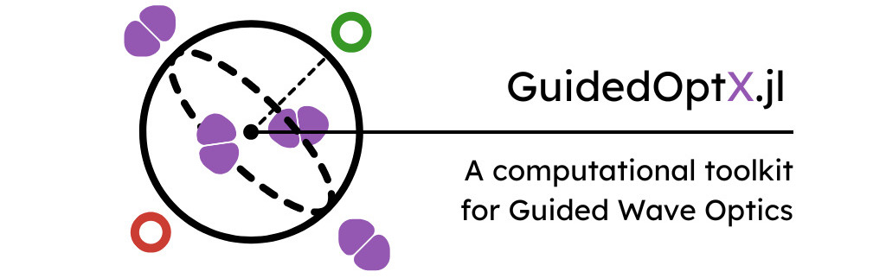

#       Guided Optics Toolkit in Julia

[Carlos Antunis Bonfim da Silva Santos](https://github.com/carlos-antunis-physics/)

[![Julia programming language](https://img.shields.io/badge/Julia-efefef.svg?logo=data:image/svg%2bxml;base64,PHN2ZyB4bWxucz0iaHR0cDovL3d3dy53My5vcmcvMjAwMC9zdmciIHZpZXdCb3g9IjAgMCAxMjggMTI4Ij48cGF0aCBkPSJNNTguMyA5My41YzAgMTUuNy0xMi43IDI4LjMtMjguMyAyOC4zLTE1LjcgMC0yOC4zLTEyLjctMjguMy0yOC4zIDAtMTUuNiAxMi43LTI4LjMgMjguMy0yOC4zIDE1LjYtLjEgMjguMyAxMi42IDI4LjMgMjguMyIgZmlsbD0iI2NiM2MzMyIvPjxwYXRoIGQ9Ik0zMCAxMjMuNGMtMTYuNSAwLTMwLTEzLjQtMzAtMzBzMTMuNC0zMCAzMC0zMCAzMCAxMy40IDMwIDMwLTEzLjUgMzAtMzAgMzB6bTAtNTYuNmMtMTQuNyAwLTI2LjcgMTItMjYuNyAyNi43czEyIDI2LjcgMjYuNyAyNi43IDI2LjctMTIgMjYuNy0yNi43LTEyLTI2LjctMjYuNy0yNi43eiIgZmlsbD0iI2VlZSIvPjxwYXRoIGQ9Ik0xMjYuNCA5My41YzAgMTUuNy0xMi43IDI4LjMtMjguMyAyOC4zcy0yOC4zLTEyLjctMjguMy0yOC4zYzAtMTUuNiAxMi43LTI4LjMgMjguMy0yOC4zczI4LjMgMTIuNiAyOC4zIDI4LjMiIGZpbGw9IiM5NTU4YjIiLz48cGF0aCBkPSJNOTggMTIzLjRjLTE2LjUgMC0zMC0xMy40LTMwLTMwczEzLjQtMzAgMzAtMzAgMzAgMTMuNCAzMCAzMC0xMy40IDMwLTMwIDMwem0wLTU2LjZjLTE0LjcgMC0yNi43IDEyLTI2LjcgMjYuN3MxMiAyNi43IDI2LjcgMjYuNyAyNi43LTEyIDI2LjctMjYuN1MxMTIuOCA2Ni44IDk4IDY2Ljh6IiBmaWxsPSIjZWVlIi8+PHBhdGggZD0iTTkyLjQgMzQuNWMwIDE1LjYtMTIuNyAyOC4zLTI4LjMgMjguMy0xNS43IDAtMjguMy0xMi43LTI4LjMtMjguM1M0OC40IDYuMiA2NCA2LjJjMTUuNyAwIDI4LjQgMTIuNyAyOC40IDI4LjMiIGZpbGw9IiMzODk4MjYiLz48cGF0aCBkPSJNNjQgNjQuNWMtMTYuNSAwLTMwLTEzLjQtMzAtMzBzMTMuNC0zMCAzMC0zMCAzMCAxMy40IDMwIDMwLTEzLjUgMzAtMzAgMzB6bTAtNTYuN2MtMTQuNyAwLTI2LjcgMTItMjYuNyAyNi43czEyIDI2LjcgMjYuNyAyNi43IDI2LjctMTIgMjYuNy0yNi43Uzc4LjcgNy44IDY0IDcuOHoiIGZpbGw9IiNlZWUiLz48L3N2Zz4=&style=flat-square)](#---)

[![Fortran programming language](https://img.shields.io/badge/Fortran-efefef.svg?logo=data:image/svg%2bxml;base64,PHN2ZyB3aWR0aD0iMTI4IiBoZWlnaHQ9IjEyOCIgdmlld0JveD0iMCAwIDEyOCAxMjgiIHhtbG5zPSJodHRwOi8vd3d3LnczLm9yZy8yMDAwL3N2ZyI+CiAgPHBhdGggc3R5bGU9ImZpbGw6IzczNGM5NDtmaWxsLW9wYWNpdHk6MTtmaWxsLXJ1bGU6bm9uemVybztzdHJva2U6bm9uZSIgZD0iTTE4Ljk2OSAwQzEzLjI1IDAgMCAxMSAwIDE4LjY2djkwLjQ1M2MwIDUuNjkyIDExLjIxIDE4LjkwMyAxOC43ODEgMTguOTAzbDkwLjU1MS0uMDMyYzYuNzM4LS4wMDQgMTguNjg4LTkuNjgzIDE4LjY4OC0xOC42MDFWMTguODRjMC02LjA3OC0xMC42MS0xOC44MzItMTguNDMtMTguODMyTDE4Ljk2OSAwem0tMS4zOTUgMTMuNjZoOTMuMzY3djQxLjcxMWwtMTAuOTkyLS4xNjRjLS4xMDEtLjA5OC0uNDAyLTMuMDQ3LS42MDUtNS43NThDOTguMTkgMzYuNyA5NS4zMjggMjkuMzYzIDg5LjgwOSAyNi41Yy0yLjkxNC0xLjUwNC03LjQ1Ny0xLjk1LTIyLjAyLTEuOTUzbC0xMy41Ny4wMDR2MzEuMjczaDIuNDFjNC4wNjYtLjA1IDkuMjM0LTEuMDA0IDEwLjk0MS0yLjA1OCAyLjIxMS0xLjM1NiA0LjA2Ny01LjI3IDQuNzItOS45ODkuNDkxLTMuNDQ1Ljg3LTYuMDIzLjg3LTYuMDIzaDEwLjY3NnY0OS42OTFINzIuNzkzdi0xLjk1N2MwLTMuMjEtMS41MDgtMTAuNjkxLTIuNTYzLTEyLjk0OS0xLjY1Ni0zLjQ2NS00LjQ2NC00LjY2OC0xMi40NDktNS40MjJsLTMuNjY0LS4zNTEuMjAzIDE2LjExM2MuMTQ5IDE1LjMwOC4yNSAxNi4xNjQgMS4yMDMgMTcuNDY5IDEuMjA3IDEuNjA1IDIuNTEyIDEuOTA2IDEwLjQ5MyAyLjUwN2w1LjM1NS4yNTgtLjAzNSAxMC45MzhIMTcuNTc0di0xMC45NDJsNC45MjItLjMwNGM5Ljk4OC0uNjUzIDkuODg3LS42MDIgMTAuMzktOC40My40NS03LjQzLS4xMTYtNjUuNTk4LS40NTItNjYuNzYyLS41NTEtMS45MjItMi42MTgtMy4wMjctOC43ODYtMy4wMjNsLTYuMDc0LS4wNFYxMy42NnoiLz4KPC9zdmc+Cg==&style=flat-square)](#---)
[![Symbolics:6.38.0](https://img.shields.io/badge/Symbolics-6.38.0-676767.svg?logo=data:image/png;base64,iVBORw0KGgoAAAANSUhEUgAAACAAAAAgCAYAAABzenr0AAAETklEQVR4AWIYsgDAe1kAt60EYbjMzIyWy2CrL8bHzPwkP2ZmKjMzKVKozGyFZjpQhnCZmZmZ7P4rX1pVVRruzXyWdLd7/+7qTjd2yc1qOSMsbxJ0/9iEvXKjqg6Fi3Yq3E1nhDVI0L0jgouhsUIVd4RzrSC+l0QdivUk7hWC7qmPxsimcEoeaW3piLCeYEIzwsZaKmWO0T310RjZkG3BZh7dtDYE9msCMjcKXUVNzIriVYxkAe53jGlau0DEn+5dpAQmXKZNHGmdrBc3C4JsQkFYlpNvvgMIi+T6hTK3JFvGWkpnZ082DtmaTD7kmz9x2eJE9redivW8Q2nRJMevTGnchHzIl+bIkzhlgiy2aJko3Oe59Scf8gVbWs9tXSr3Cy+iRQ82QUJeK0i+oZ3B9ciVY/+fWzV2ydwVrOorutI3AiPAVPA1KG5wq0+uQAZPUgf50hxeqe3V7j/3b5zjAFI99lmL3uwY/Kpny16sqxo4BgLgJLgD5upc2rD+IOMmaEkDvt6+XsM/nxaUBHVWjsST3bZOKV4+gCAOrnE6y7JuAZwBvE7wOHgdkM1OJrxFF8gXZDjygzllJTH2IAIIjBf9nbLP3mtPTPXywRSP7WtdtxuMNpj+BcaB/5ngFFAMPMOePZmG0of+r8PF2KAkqomPFE9H9qla9vzOpU8/bfyIPGF4tjPRI6wCmdVqDAbpDXs/3bsEKrCTghgvJmRdhVQ3P4eyT/V0/KZI9q0OWMiyfTM743GC+o0WgBA7J6vs66V47LfA8URL9l88Vu7VIA1k28a+klhaEmKPoxK3YkR/vYcXn4fvomX/pG1gDjfLsyz7cJCjhgoMBNgR/i4PDSLzDAogzcWbHaVFgb4qdL+JrXg/G8+2jXsvtmUoADXjgYG1jra1aeshiG0mfpXBesDr+qJY9r1AEmhm8BkCipsFAfFt2A2BMaJ6/7hOcvGvh7YeH2Xi87Wu1A4whT3vBxXBZDDQUJ29oL3paxDUKK0KvrjX9Kv/R+39u23/m/j4SNDAeWDTbc8bQAZ/gCT2XMt8Haj/UwDgR92n1/ZDqAL2riY+pcA0cAsEwCrQwWAjgFMsuMusaqYNO6GLVoGPYn+415nm4b2h/c8vf8SCKgPKgaxaSdA8G5uiEF+uBfBhrJf1aWEXQ/YbWRWik8LCKhUp4Db2k2mVsACjtfILsRt79+5d7MGd8JStFQI4wipxFoHIOA/eXOHtWDOvopG+2BqyoL4xXoyVIX6WiR8JFxa2MnVY7WpfC+shEifhNS0QBn0dwRowL81jV3AdCrs+yU+5u2PC7uMFtY/kix0KEQWrfB5Ov9UQO6YJMjB2DddI+d3F2f+LWultVzXFa/sMJ+MEBLA+hQVkJOlJV0jABCy2a2ADhCfi+pn8cXze/zX1xhqhsyLda+fT3PxLEP+AAlztcX0tif6vSUAS4z5ANV6CED9e9N+dFCSOCYNRAADkSRuoRilhAQAAAABJRU5ErkJggg==&style=flat-square&labelColor=efefef)](#---)
[![GLMakie:0.11.5](https://img.shields.io/badge/GLMakie-0.11.5-676767.svg?logo=data:image/png;base64,iVBORw0KGgoAAAANSUhEUgAAABwAAAAcCAMAAABF0y+mAAAA+VBMVEVHcEyakW4/grHidkmvf2lxiY3YjUfkySjlrTLcMmXeQl9YfaO+t0njhkK6rFCkToHVZVg9hrFEiaygToRScqrcekuXUoiWVIjdP2DcMmU0g7fOwDu2RHl9oHxJdq7gX1J6moBya5fnyyXcMmXjkz3nwSnnyyUwgbpZkprgXlPNOm3MvzzkkzybpWaWXoTcMmUwgbrnyiU0gLlDiKs5g7XfUljPOmw/e7PdOWPkoDfaxTDAQHPGvEHjySnnwSpQjKHRwDjcZ1NLd62ySXrkkz3muC5cj5hecqLeSFx4noFmlZCws1OwoFutZHPMWWJ6gYrRpkLkmTq7cGWnSnXnAAAAL3RSTlMAI1UoEQl8j/7O/jT1/lP5T5sdV8tFcP5x1N8p09Hwj4qmc6abz6K2eOPOiMbDwPsTYTsAAAFUSURBVCiRjdJnc4JAEAbgpZwxQlCssSSa3sOBhajYMEoUUZP//2Nyd6CC0Zm8X9jhmd2FA4D/JXYrAKDq+QFS4u3PMwFGza9Eao/KdxOKsRzBD60ohO1e7/uYYqhpN1u61vUABfGpmaCoacHqE52mTzAHIG5QOw3jJP5NV22xGMX2K0DV37nX2aOt5IFGm9Yd9nqdznC9Jq+yXLZaEWRkWfIilvrxxt0u4wAZybK7WCic5yXHY6YBdoZDqwzAvXEgovdCPlOhzQGSiQqraqvVFSuSZPYzq14s2fWPYz51HKZ5MrvCbomy6yJWTQe2k6VFplBIZvwGpHDsyg/qpm3zABIS89z26LlZLS0+DuqNhmna2azjSKFPdjGbzafUDIMwab+MILV6A2ODxjTDKPlmYBbCfPhXQOrOMH5AEI1U2lhJgr/hfeMPEI2KsXqESNLp47afXwyMR7CZkyqOAAAAAElFTkSuQmCC&style=flat-square&labelColor=efefef)](#---)
[![Numpy:2.1.3](https://img.shields.io/badge/Numpy-2.1.3-676767.svg?logo=data:image/png;base64,iVBORw0KGgoAAAANSUhEUgAAASwAAAEsBAMAAACLU5NGAAAALVBMVEVHcExMq89OeM9Nq89Nq89MeM9Nqs9Nq89Nq89Nq89Nq89Nd89Nq89Nq89Nd8+lEujsAAAADXRSTlMAP4DAgEAd36RZkr9sxG7xsQAACW5JREFUeNrt3T9rG0kUAPDJIgVsCRNw4+ZA3AcQGK64Kwz6AgGR9mBJadxdaYiKa9wdGFK4TZUusNwHMOlSpbLAJmRACFQJ9BmuSGJrd9/fmTe7w5EtY2X3h/Q0+97bGY1zP4+fx9NxcJWjarzwV1mqfH6u8cL7/FzfVZm5HlVZucZ+77jKUpWNq6HKxDXwPkMXoMrABap6dyGqnl2oqlcXoerRdeh9hi5G1ZPrwvsMXQJVDy6RqnOXUNWxS6zq1HXufYYulSpb11WWn+KpyzG6TjsdIaSuy47H0xOR6k3ndx+Ja9nDvZp3feklsznmVK9dhq6HnlS06+5Ff9n8cc+q80ud6/4afPnMfPRUue4/gi/+7GfGKp0Lvvon9C8xdxq56x34whtCHJOLSl3vyZfNjFWo660kwTpmPuGYvP0PgeuUTTlmxio0fbrRqAxcF8K07ob+nC9E39SYyot2vRG2dmbGKtr1VdxwmhmrKBec9o29t3RdKMuGGzjtO1h4S9eFupx5rVEFui5syqxnZ/hZAlyHNuUfpQpwHdqUpc//oc8yM1Z5/7eBSuk6lJSmvOv5B/4sCtfAqBXzUnKWmbGKdX2WnWVmrGJcn6RnmRmrSNeN/CwzYxXheqs5y8xYhbqOdWeZGauwRgM9uitdahVe0lu6BmYqtcvw7bq7Dr9Lpwuu++uY7CHVVxFpf4S4LAeuj7HZVpJhXnQukcvypig818GZ1ZlE6dZ76blY1zvDNFDx1ItxKVSBUxzOr/UulYpxnSL/5V7tUqoCitcBPsCiFex758xcfxFfX50rQIW6Lsn2h8bFq+ZiF9zAeprhKXcJ3qvpROj6yl70TuiSfILTncy1FFxS5kJUzxoskWspuvEhyWHNhal+a7IEri/C2zHvwlRnyxaLdcHlBJQkcC5U5QEW44JVcFOGdl3hWRDEgl3n1JWwVhHlIlQwa427ENUHZVF0sCBVMAt3IVd5qS7WDkgVwsJcyNj9MrSIRL84CAtxvQ5pYClcj19njIW4ghpYYtdTRoayxC5BA+vhhVJFsHZrK5XQtZ+9EiyRS9jAEsxoqeXUFEvgErfVWFc9syBZrEvR7GNcjXyHZjEu1VRK0tXMDhnWbmKlIl2tnJVjrQMf6alc7QyfY+3iHgiJegNA3cGyJlZtX42KZ61St+7B2pFlrRM/6IArbZa1S/tYCKn/edbcWUS9TiVgVc7AhfXnznwoaxM8HUHQNQxnbV20C+9lhrOo4HKxy48iWJWLc1F93wjWxkW5yG50BGvL5YLn4dMkIlhMcNEuZvJGDKtywS5uSkkMa+NCXexElxjW1gW6kOlKBy9MWHxwwS5ENV4YsSoX4kJV3oi1EtXXJ1KVFUtW9tddhMqKtRN2XI5lKjPWROsiVWasyulctMqMtXEqF6b6cVErFjSgDieYi1OZsaABtUDahcenbJ1kxgKCq1C0VxvVmxlrA7E0rlpNacbagiy5q17pmrGA4CoU7ehG/W3HqmDWbj3XqwxZG4QluV+2ehV2rC3G4l3tDoodqx1chTC/APoUhqwKZdEuqHtiyFrhLHXf15C1Jli4C664DVk7ioW5kD6AJWtCsWAX1p2wZFUkC3KhPRNL1oZmtV14J8eStWVYTRfRX7JkNQfUgv6yUt0lU1bFsfZdZM/LlLVhWXtv6C+dsbbdsRoTxEhWI7gSspoTxGhW1RGr9XMbNGvTDav9IyA0a9sJC3h0TLPqwZWIBT3QZlhVehb4mJ1hrZKz4Mk4DGudmoVMqWJYu8QsbKIXx5okZaHTzzhWlZJ1j07y4libhCxizRfH2qZjUSvRONb+gGrLItfHsawqEYteH8eyNmlYzKo9lrVNw6JVPGvvwoasmYtlVQlYnErA2tizWJWAtTVnvXMGrKcrG7Fg1YBmbfHgsmHBq0QGTJ24wVNBE9YV0gRmWKtbNBU0YWGtaY5VoqlgMtaAL/ZXIzQVTMUaCHoQqyEa84lYA0lrZOVusQE1DWvsZawSG1CTsMZeyBph107BGnspCw2uBKyxF7OAITYVa+wVrCMkuMJZSOU19hpWgVw8mIVUE2OvYjkkuEJZmGqhZCHBFcgSqSQsJLjCWDKVhDWErx7EEqokrPb9pwplSVUiVgn+awDrTqoSsUZgKqhnyVUi1hBMBdUspKs2DlhQ8y1zv4Uur2VpVDJWCcW8kiX5YQElawQNqDqWTiVjDaEBVcXCurWBzxO/V4VQcGlYaA85jgUFl4KFL6yOY0HBJWcRy73jWFBwiVnUIvQ4FhRcUha5ND6SBQSXkEUv2I9kAcElYzHL4iNZQHCJWNxi/UhW+y9zCYv9CYFYVitzrgQsZCF1/IIavPe34lmYamHHapVla5aFqrwhq/UnjoWrLFmt4HpFswiVJav15vxLsk4IlSXL8S37fRalMmUJnnBwa+AOrBbU7LFG0azHDNmSNYxlPeXtlqx2cqNj7VUTpqwyirVf45iyRjGsWuVlyhpGsOr1oClLEFxzkcqYVYaymrWzLWsUyGpV9LasYRir3WewZfHBNZd1P4xZZQAL6skYs0Z6FtgpMmYN1Sy4f2XMYoNrLuuqWbNKHQvr9VmzChUL/QFkLatkWE7DwjcW0rKGU4almCKOq9QsV0xp1pGYRaj0rGb0rJwquOYiVQCrceEmy0lZpgtqWq6VbuJZQlbN1WIddcICfwi6IFhFFyxks98CZ9H3HxsWugXxK5xVJmcRGyP/irJGqVlLwVTPNmuYmLWUTEFts8jgimexm0hPEVaZkiXY2noKs0YJWaINt6cga5iOJdwGfAqxqOCKY0k3Jx9OIVaZiCXfnLyYOFVwxbBit0wfJmHFb+R+m4BlsL18ac+y2PR+ZM6yUBHBFcgyURHBFcYyUuGZcxDLSoVnziGsBysVXpYFsAxVaFmmZ1mq0OBSs363VKHBpWaZqtDgUrOMj2merKM8WUWeLOT+0zurzJM1ypPlMmWVebJG4axLl/C4DWW9SakCP0UJK60qdJ1PYhV4X+RZyVXQ28Wy0quc+1PN6kIFzZGlWV+d68VFs7pStcKLZHWmarkoVoeqZtgTrKXr9JjKWB2r6i6U1bmqFl4Yq3tVzYWw+lDtu2BWP6q98AJZfameXBDrS2+qx9kmAKtH1WN4tVm9qn64Wiyzvmjo8Qpi9a76FvYNVgYq56ZNVhYqV9zWWXmonCtqrFxUzhV7rIdsVPvHSZYql6fq/338B64kfY+Ku6kyAAAAAElFTkSuQmCC&style=flat-square&labelColor=efefef)](#---)

Understanding the nature of light and how to control it, in classical and quantum regime, represents a research area of significant impact nowadays, driven largely by the emergence of quantum technologies as a proeminent source of novel applications. This `Julia` toolkit aims to provide a simple but widely applicable framework for academic research on classical and quantum optics, specially in the context of guided waves design - but also is capable to approach on bulk optics and non-linear effects. It's mainly designed for simulations on experimental contexts, via numerical methods, but also comprehends theoretical utils on algebraic manipulation of optical modes - classical and quantum in both contexts.

##      License

This toolkit was implements under [MIT License](./LICENSE).

##      Features and capabilites

This toolkit was design to approach photonic chip design both on classical and quantum optics. The toolkit is divided through three main capabilities

*   **Classical optics.**
    Numerical and analytical approach on paraxial wave optics (encompassing linear, both scalar and vector, optics and non-linear regimes), besides some phase optimization algorithms for bulk optics.

*   **Quantum optics.**
    Analytical approach on quantum states of light (both in Fock space and as polarization states), and numerical simulations of its propagation through photonic chips.

*   **Optical waveguides design.**
    Design of optical waveguides through phase optimization methods, besides some estimations through neural networks.

###     Classical optics

>   The submodule designed to classical optics is widely inspired on [FiniteDifferenceBPM](https://github.com/Windier/FiniteDifferenceBPM/) `Matlab library` implemented by [José Carlos do A. Rocha](https://github.com/Windier/).

The main features of classical optics submodule consists in:

- **Symbolic manipulation of modes.** Robust tools on algebraic manipulation of free-space expression of classical modes which allows also numerical evaluations.
- **Numerical propagation of fields.** Fourier <!--and Finite-Differences--> beam propagation methods to estimate waveguides and nonlinear responses effects on light propagation in the paraxial approximation through photonic chips.
- **Polarization optics.** Symbolic and numerical methods of classical optics is also implemented for media with polarization effects.
- **Phase optimization.** Numerical methods on phase optimization to implement unitary transformations over classical light.

###     Quantum optics

The main features of quantum optics submodule consists in:

- **Symbolic manipulation of light quantum states.** Robust tools on algebraic manipulation of light quantum states, both as optical modes and as polarization states.
- **Numerical propagation of photons.** Numerical methods on photon propagation through photonic chips.

