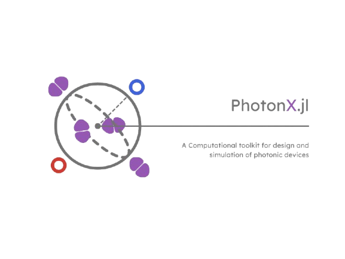

<div align="center">

[
    
](#---)

#       `PhotonX` in Julia

A Computational Toolkit for design and simulation of photonic devices

[Carlos Antunis Bonfim da Silva Santos](https://github.com/carlos-antunis-physics/)

[![Julia programming language](https://img.shields.io/badge/Julia-efefef.svg?logo=data:image/svg%2bxml;base64,PHN2ZyB4bWxucz0iaHR0cDovL3d3dy53My5vcmcvMjAwMC9zdmciIHZpZXdCb3g9IjAgMCAxMjggMTI4Ij48cGF0aCBkPSJNNTguMyA5My41YzAgMTUuNy0xMi43IDI4LjMtMjguMyAyOC4zLTE1LjcgMC0yOC4zLTEyLjctMjguMy0yOC4zIDAtMTUuNiAxMi43LTI4LjMgMjguMy0yOC4zIDE1LjYtLjEgMjguMyAxMi42IDI4LjMgMjguMyIgZmlsbD0iI2NiM2MzMyIvPjxwYXRoIGQ9Ik0zMCAxMjMuNGMtMTYuNSAwLTMwLTEzLjQtMzAtMzBzMTMuNC0zMCAzMC0zMCAzMCAxMy40IDMwIDMwLTEzLjUgMzAtMzAgMzB6bTAtNTYuNmMtMTQuNyAwLTI2LjcgMTItMjYuNyAyNi43czEyIDI2LjcgMjYuNyAyNi43IDI2LjctMTIgMjYuNy0yNi43LTEyLTI2LjctMjYuNy0yNi43eiIgZmlsbD0iI2VlZSIvPjxwYXRoIGQ9Ik0xMjYuNCA5My41YzAgMTUuNy0xMi43IDI4LjMtMjguMyAyOC4zcy0yOC4zLTEyLjctMjguMy0yOC4zYzAtMTUuNiAxMi43LTI4LjMgMjguMy0yOC4zczI4LjMgMTIuNiAyOC4zIDI4LjMiIGZpbGw9IiM5NTU4YjIiLz48cGF0aCBkPSJNOTggMTIzLjRjLTE2LjUgMC0zMC0xMy40LTMwLTMwczEzLjQtMzAgMzAtMzAgMzAgMTMuNCAzMCAzMC0xMy40IDMwLTMwIDMwem0wLTU2LjZjLTE0LjcgMC0yNi43IDEyLTI2LjcgMjYuN3MxMiAyNi43IDI2LjcgMjYuNyAyNi43LTEyIDI2LjctMjYuN1MxMTIuOCA2Ni44IDk4IDY2Ljh6IiBmaWxsPSIjZWVlIi8+PHBhdGggZD0iTTkyLjQgMzQuNWMwIDE1LjYtMTIuNyAyOC4zLTI4LjMgMjguMy0xNS43IDAtMjguMy0xMi43LTI4LjMtMjguM1M0OC40IDYuMiA2NCA2LjJjMTUuNyAwIDI4LjQgMTIuNyAyOC40IDI4LjMiIGZpbGw9IiMzODk4MjYiLz48cGF0aCBkPSJNNjQgNjQuNWMtMTYuNSAwLTMwLTEzLjQtMzAtMzBzMTMuNC0zMCAzMC0zMCAzMCAxMy40IDMwIDMwLTEzLjUgMzAtMzAgMzB6bTAtNTYuN2MtMTQuNyAwLTI2LjcgMTItMjYuNyAyNi43czEyIDI2LjcgMjYuNyAyNi43IDI2LjctMTIgMjYuNy0yNi43Uzc4LjcgNy44IDY0IDcuOHoiIGZpbGw9IiNlZWUiLz48L3N2Zz4=&style=flat-square)](#---)
[](#---)
[![Fortran programming language](https://img.shields.io/badge/Fortran-efefef.svg?logo=data:image/svg%2bxml;base64,PHN2ZyB3aWR0aD0iMTI4IiBoZWlnaHQ9IjEyOCIgdmlld0JveD0iMCAwIDEyOCAxMjgiIHhtbG5zPSJodHRwOi8vd3d3LnczLm9yZy8yMDAwL3N2ZyI+CiAgPHBhdGggc3R5bGU9ImZpbGw6IzczNGM5NDtmaWxsLW9wYWNpdHk6MTtmaWxsLXJ1bGU6bm9uemVybztzdHJva2U6bm9uZSIgZD0iTTE4Ljk2OSAwQzEzLjI1IDAgMCAxMSAwIDE4LjY2djkwLjQ1M2MwIDUuNjkyIDExLjIxIDE4LjkwMyAxOC43ODEgMTguOTAzbDkwLjU1MS0uMDMyYzYuNzM4LS4wMDQgMTguNjg4LTkuNjgzIDE4LjY4OC0xOC42MDFWMTguODRjMC02LjA3OC0xMC42MS0xOC44MzItMTguNDMtMTguODMyTDE4Ljk2OSAwem0tMS4zOTUgMTMuNjZoOTMuMzY3djQxLjcxMWwtMTAuOTkyLS4xNjRjLS4xMDEtLjA5OC0uNDAyLTMuMDQ3LS42MDUtNS43NThDOTguMTkgMzYuNyA5NS4zMjggMjkuMzYzIDg5LjgwOSAyNi41Yy0yLjkxNC0xLjUwNC03LjQ1Ny0xLjk1LTIyLjAyLTEuOTUzbC0xMy41Ny4wMDR2MzEuMjczaDIuNDFjNC4wNjYtLjA1IDkuMjM0LTEuMDA0IDEwLjk0MS0yLjA1OCAyLjIxMS0xLjM1NiA0LjA2Ny01LjI3IDQuNzItOS45ODkuNDkxLTMuNDQ1Ljg3LTYuMDIzLjg3LTYuMDIzaDEwLjY3NnY0OS42OTFINzIuNzkzdi0xLjk1N2MwLTMuMjEtMS41MDgtMTAuNjkxLTIuNTYzLTEyLjk0OS0xLjY1Ni0zLjQ2NS00LjQ2NC00LjY2OC0xMi40NDktNS40MjJsLTMuNjY0LS4zNTEuMjAzIDE2LjExM2MuMTQ5IDE1LjMwOC4yNSAxNi4xNjQgMS4yMDMgMTcuNDY5IDEuMjA3IDEuNjA1IDIuNTEyIDEuOTA2IDEwLjQ5MyAyLjUwN2w1LjM1NS4yNTgtLjAzNSAxMC45MzhIMTcuNTc0di0xMC45NDJsNC45MjItLjMwNGM5Ljk4OC0uNjUzIDkuODg3LS42MDIgMTAuMzktOC40My40NS03LjQzLS4xMTYtNjUuNTk4LS40NTItNjYuNzYyLS41NTEtMS45MjItMi42MTgtMy4wMjctOC43ODYtMy4wMjNsLTYuMDc0LS4wNFYxMy42NnoiLz4KPC9zdmc+Cg==&style=flat-square)](#---)
[![Symbolics:6.43.0](https://img.shields.io/badge/Symbolics-6.43.0-676767.svg?logo=data:image/png;base64,iVBORw0KGgoAAAANSUhEUgAAACAAAAAgCAYAAABzenr0AAAETklEQVR4AWIYsgDAe1kAt60EYbjMzIyWy2CrL8bHzPwkP2ZmKjMzKVKozGyFZjpQhnCZmZmZ7P4rX1pVVRruzXyWdLd7/+7qTjd2yc1qOSMsbxJ0/9iEvXKjqg6Fi3Yq3E1nhDVI0L0jgouhsUIVd4RzrSC+l0QdivUk7hWC7qmPxsimcEoeaW3piLCeYEIzwsZaKmWO0T310RjZkG3BZh7dtDYE9msCMjcKXUVNzIriVYxkAe53jGlau0DEn+5dpAQmXKZNHGmdrBc3C4JsQkFYlpNvvgMIi+T6hTK3JFvGWkpnZ082DtmaTD7kmz9x2eJE9redivW8Q2nRJMevTGnchHzIl+bIkzhlgiy2aJko3Oe59Scf8gVbWs9tXSr3Cy+iRQ82QUJeK0i+oZ3B9ciVY/+fWzV2ydwVrOorutI3AiPAVPA1KG5wq0+uQAZPUgf50hxeqe3V7j/3b5zjAFI99lmL3uwY/Kpny16sqxo4BgLgJLgD5upc2rD+IOMmaEkDvt6+XsM/nxaUBHVWjsST3bZOKV4+gCAOrnE6y7JuAZwBvE7wOHgdkM1OJrxFF8gXZDjygzllJTH2IAIIjBf9nbLP3mtPTPXywRSP7WtdtxuMNpj+BcaB/5ngFFAMPMOePZmG0of+r8PF2KAkqomPFE9H9qla9vzOpU8/bfyIPGF4tjPRI6wCmdVqDAbpDXs/3bsEKrCTghgvJmRdhVQ3P4eyT/V0/KZI9q0OWMiyfTM743GC+o0WgBA7J6vs66V47LfA8URL9l88Vu7VIA1k28a+klhaEmKPoxK3YkR/vYcXn4fvomX/pG1gDjfLsyz7cJCjhgoMBNgR/i4PDSLzDAogzcWbHaVFgb4qdL+JrXg/G8+2jXsvtmUoADXjgYG1jra1aeshiG0mfpXBesDr+qJY9r1AEmhm8BkCipsFAfFt2A2BMaJ6/7hOcvGvh7YeH2Xi87Wu1A4whT3vBxXBZDDQUJ29oL3paxDUKK0KvrjX9Kv/R+39u23/m/j4SNDAeWDTbc8bQAZ/gCT2XMt8Haj/UwDgR92n1/ZDqAL2riY+pcA0cAsEwCrQwWAjgFMsuMusaqYNO6GLVoGPYn+415nm4b2h/c8vf8SCKgPKgaxaSdA8G5uiEF+uBfBhrJf1aWEXQ/YbWRWik8LCKhUp4Db2k2mVsACjtfILsRt79+5d7MGd8JStFQI4wipxFoHIOA/eXOHtWDOvopG+2BqyoL4xXoyVIX6WiR8JFxa2MnVY7WpfC+shEifhNS0QBn0dwRowL81jV3AdCrs+yU+5u2PC7uMFtY/kix0KEQWrfB5Ov9UQO6YJMjB2DddI+d3F2f+LWultVzXFa/sMJ+MEBLA+hQVkJOlJV0jABCy2a2ADhCfi+pn8cXze/zX1xhqhsyLda+fT3PxLEP+AAlztcX0tif6vSUAS4z5ANV6CED9e9N+dFCSOCYNRAADkSRuoRilhAQAAAABJRU5ErkJggg==&style=flat-square&labelColor=efefef)](#---)
[](#---)
[![FFTW:1.9.0](https://img.shields.io/badge/FFTW-1.9.0-676767.svg?logo=data:image/png;base64,iVBORw0KGgoAAAANSUhEUgAAACAAAAAgCAYAAABzenr0AAAC0klEQVR4AWIYcsChwYHFfIa6P6C5qoh2Ggqig7u7e/JxqEuKuzvpx3ZsYYU7bHCLssNdmuLuVsHdff/dy7zFd0tei9xzbr333jeZydhVVnHIzFmHwpxzKozqVJkJ5Dv4k3DIrNuhMi/RNFIKX9lVhvsz5hI7Dg3SiFE5TCfVgFjCtiuOQeFEYqCTSeQ/ECug4BEibJDHIRYwqx3rkbJSBMiyCXGNIFrYlS5DiSANnQo7AqKFU+0STxsAJ2ZO9A2odhlNHQAnB6KFVezUBsVyqALIce1jdANi7lAEuA+xgl1lBxqsQo5NZgdBLIENtVJvALvCrIY/AVxC89AgtQzzVKfKzoc/CU7t2BaDbMAN+NyhsMlomkJe48xvdAld20E0iABUDHgsfMBj8gU58/cAZ05Bfgu4TccecKaJ+H2F8jUiFSSvf4IwXTsm8r5vIq+lIH+I0zVN9GreVatWVYSSEHb1bRfgLAE0jJTBW0GPuQWUAnXm8RZoehMNI2UwKPMnC48nnrYtiv8kJuUx6DZ/um+3N4MikGedaIriH4mJDv4S4s+0yy17BSz7XSKulw8583koAhQ9S8QN8B65XPCQM40lokb50GPtn2su8ac9RNQosU/GQ8Bt2UsVgDNL+af37ySCFDwAKPaMJgC5bAXKf4sywEsS4CsRpODLvADT/U/pAvh/kgBBugCm67kBBF67QhNA4rXH2APmHZQB1hXogTVUTcj7BHjoslpRMMdggKxQP1PXvCmY6mNRMMtggByBP2UHAjzNHmMBLALkgnYSvL59kIsnw3rVwrG6p2v83OYr70Z2rgZFcGTqkaoofFlf6bUHG2ddqAUFcdfprBHwmGVS3lLMM5CbX3TvXhVKgTpXrYITsQmrkVGKeRYuJWXL1CM1oDQ84GwM7oZlZCNiVW6i6Ul8v+hBP1sH0AmybLDDF6LZSbKcBN7vw+flpFfgf8NvGqzoTESMEbsAAAAASUVORK5CYII=&style=flat-square&labelColor=efefef)](#---)
[![ClassicalOrthogonalPolynomials:0.11.1](https://img.shields.io/badge/ClassicalOrthogonalPolynomials-0.11.1-676767.svg?logo=data:image/png;base64,iVBORw0KGgoAAAANSUhEUgAAACAAAAAgCAYAAABzenr0AAAC0klEQVR4AWIYcsChwYHFfIa6P6C5qoh2Ggqig7u7e/JxqEuKuzvpx3ZsYYU7bHCLssNdmuLuVsHdff/dy7zFd0tei9xzbr333jeZydhVVnHIzFmHwpxzKozqVJkJ5Dv4k3DIrNuhMi/RNFIKX9lVhvsz5hI7Dg3SiFE5TCfVgFjCtiuOQeFEYqCTSeQ/ECug4BEibJDHIRYwqx3rkbJSBMiyCXGNIFrYlS5DiSANnQo7AqKFU+0STxsAJ2ZO9A2odhlNHQAnB6KFVezUBsVyqALIce1jdANi7lAEuA+xgl1lBxqsQo5NZgdBLIENtVJvALvCrIY/AVxC89AgtQzzVKfKzoc/CU7t2BaDbMAN+NyhsMlomkJe48xvdAld20E0iABUDHgsfMBj8gU58/cAZ05Bfgu4TccecKaJ+H2F8jUiFSSvf4IwXTsm8r5vIq+lIH+I0zVN9GreVatWVYSSEHb1bRfgLAE0jJTBW0GPuQWUAnXm8RZoehMNI2UwKPMnC48nnrYtiv8kJuUx6DZ/um+3N4MikGedaIriH4mJDv4S4s+0yy17BSz7XSKulw8583koAhQ9S8QN8B65XPCQM40lokb50GPtn2su8ac9RNQosU/GQ8Bt2UsVgDNL+af37ySCFDwAKPaMJgC5bAXKf4sywEsS4CsRpODLvADT/U/pAvh/kgBBugCm67kBBF67QhNA4rXH2APmHZQB1hXogTVUTcj7BHjoslpRMMdggKxQP1PXvCmY6mNRMMtggByBP2UHAjzNHmMBLALkgnYSvL59kIsnw3rVwrG6p2v83OYr70Z2rgZFcGTqkaoofFlf6bUHG2ddqAUFcdfprBHwmGVS3lLMM5CbX3TvXhVKgTpXrYITsQmrkVGKeRYuJWXL1CM1oDQ84GwM7oZlZCNiVW6i6Ul8v+hBP1sH0AmybLDDF6LZSbKcBN7vw+flpFfgf8NvGqzoTESMEbsAAAAASUVORK5CYII=&style=flat-square&labelColor=efefef)](#---)
[![SpecialFunctions:2.5.1](https://img.shields.io/badge/SpecialFunctions-2.5.1-676767.svg?logo=data:image/png;base64,iVBORw0KGgoAAAANSUhEUgAAACAAAAAgCAYAAABzenr0AAAC0klEQVR4AWIYcsChwYHFfIa6P6C5qoh2Ggqig7u7e/JxqEuKuzvpx3ZsYYU7bHCLssNdmuLuVsHdff/dy7zFd0tei9xzbr333jeZydhVVnHIzFmHwpxzKozqVJkJ5Dv4k3DIrNuhMi/RNFIKX9lVhvsz5hI7Dg3SiFE5TCfVgFjCtiuOQeFEYqCTSeQ/ECug4BEibJDHIRYwqx3rkbJSBMiyCXGNIFrYlS5DiSANnQo7AqKFU+0STxsAJ2ZO9A2odhlNHQAnB6KFVezUBsVyqALIce1jdANi7lAEuA+xgl1lBxqsQo5NZgdBLIENtVJvALvCrIY/AVxC89AgtQzzVKfKzoc/CU7t2BaDbMAN+NyhsMlomkJe48xvdAld20E0iABUDHgsfMBj8gU58/cAZ05Bfgu4TccecKaJ+H2F8jUiFSSvf4IwXTsm8r5vIq+lIH+I0zVN9GreVatWVYSSEHb1bRfgLAE0jJTBW0GPuQWUAnXm8RZoehMNI2UwKPMnC48nnrYtiv8kJuUx6DZ/um+3N4MikGedaIriH4mJDv4S4s+0yy17BSz7XSKulw8583koAhQ9S8QN8B65XPCQM40lokb50GPtn2su8ac9RNQosU/GQ8Bt2UsVgDNL+af37ySCFDwAKPaMJgC5bAXKf4sywEsS4CsRpODLvADT/U/pAvh/kgBBugCm67kBBF67QhNA4rXH2APmHZQB1hXogTVUTcj7BHjoslpRMMdggKxQP1PXvCmY6mNRMMtggByBP2UHAjzNHmMBLALkgnYSvL59kIsnw3rVwrG6p2v83OYr70Z2rgZFcGTqkaoofFlf6bUHG2ddqAUFcdfprBHwmGVS3lLMM5CbX3TvXhVKgTpXrYITsQmrkVGKeRYuJWXL1CM1oDQ84GwM7oZlZCNiVW6i6Ul8v+hBP1sH0AmybLDDF6LZSbKcBN7vw+flpFfgf8NvGqzoTESMEbsAAAAASUVORK5CYII=&style=flat-square&labelColor=efefef)](#---)

<div align="justify" style="width:750px">

Understanding the nature of light and how to control it, in classical and quantum regime, represents a research area of significant impact nowadays, driven largely by the emergence of quantum technologies as a proeminent source of novel applications. This `Julia` toolkit aims to provide a simple but widely applicable framework for academic research on photonics, specially in the context of guided waves design - but also is capable to approach on bulk optics and non-linear effects. It's mainly designed for simulations on experimental contexts, via numerical methods, but also comprehends theoretical utils on algebraic manipulation of optical modes - in both contexts, classical and quantum.

##      License

This toolkit was implements under [MIT License](./LICENSE).
<!-- 
##      Features and capabilites

This toolkit was design to approach photonic chip design both on classical and quantum optics. The toolkit is divided through three main capabilities.

*   **Classical waveguide optics.**
    Numerical and analytical approach on paraxial guidewave optics, besides some phase optimization algorithms for bulk optics.

*   **Optical waveguides design.**
    Design of optical waveguides through phase optimization methods, besides some estimations through neural networks.

*   **Quantum optics.**
    Analytical approach on quantum states of light (both in Fock space and as polarization states), and numerical simulations of its propagation through photonic chips.

###     Classical optics

>   The submodule designed to classical optics is widely inspired on [FiniteDifferenceBPM](https://github.com/Windier/FiniteDifferenceBPM/) `Matlab library` implemented by [José Carlos do A. Rocha](https://github.com/Windier/).

The main features of classical optics submodule consists in:

- **Symbolic manipulation of modes.** Robust tools on algebraic manipulation of free-space expression of classical modes which allows also numerical evaluations.
- **Numerical propagation of fields.** Fourier and Finite-Differences beam propagation methods to estimate waveguides and nonlinear responses effects on light propagation in the paraxial approximation through photonic chips.
- **Polarization optics.** Symbolic and numerical methods of classical optics is also implemented for media with polarization effects.
- **Phase optimization.** Numerical methods on phase optimization to implement unitary transformations over classical light.

###     Quantum optics

The main features of quantum optics submodule consists in:

- **Symbolic manipulation of light quantum states.** Robust tools on algebraic manipulation of light quantum states, both as optical modes and as polarization states.
- **Numerical propagation of photons.** Numerical methods on photon propagation through photonic chips.

##      Usage examples

Some [examples of usage](./examples/README.md) are available in this repository. -->

##      Cite us

If you find this toolkit useful in your research, please cite this repository as:

```tex
@software{
    Bonfim_da_Silva_Santos_PhotonX_jl,
    author = {Bonfim da Silva Santos, C. Antunis},
    title = {{PhotonX.jl}},
    url = {https://github.com/carlos-antunis-physics/PhotonX.jl},
    version = {0.0.1}
}
```

</div>

</div>
