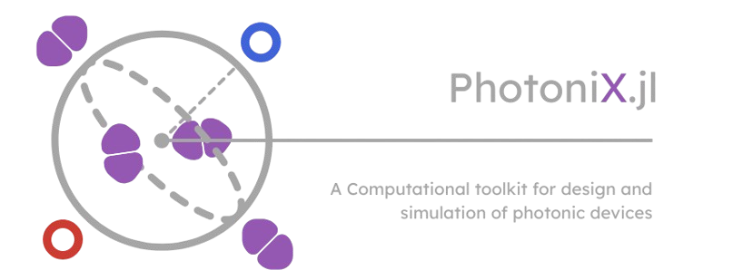

<div align="center">

[
    
](#---)

#       `PhotoniX` in Julia

A Computational Toolkit for design and simulation of photonic devices

[Carlos Antunis Bonfim da Silva Santos](https://github.com/carlos-antunis-physics/)

[![Julia programming language](https://img.shields.io/badge/Julia-efefef.svg?logo=data:image/svg%2bxml;base64,PHN2ZyB4bWxucz0iaHR0cDovL3d3dy53My5vcmcvMjAwMC9zdmciIHZpZXdCb3g9IjAgMCAxMjggMTI4Ij48cGF0aCBkPSJNNTguMyA5My41YzAgMTUuNy0xMi43IDI4LjMtMjguMyAyOC4zLTE1LjcgMC0yOC4zLTEyLjctMjguMy0yOC4zIDAtMTUuNiAxMi43LTI4LjMgMjguMy0yOC4zIDE1LjYtLjEgMjguMyAxMi42IDI4LjMgMjguMyIgZmlsbD0iI2NiM2MzMyIvPjxwYXRoIGQ9Ik0zMCAxMjMuNGMtMTYuNSAwLTMwLTEzLjQtMzAtMzBzMTMuNC0zMCAzMC0zMCAzMCAxMy40IDMwIDMwLTEzLjUgMzAtMzAgMzB6bTAtNTYuNmMtMTQuNyAwLTI2LjcgMTItMjYuNyAyNi43czEyIDI2LjcgMjYuNyAyNi43IDI2LjctMTIgMjYuNy0yNi43LTEyLTI2LjctMjYuNy0yNi43eiIgZmlsbD0iI2VlZSIvPjxwYXRoIGQ9Ik0xMjYuNCA5My41YzAgMTUuNy0xMi43IDI4LjMtMjguMyAyOC4zcy0yOC4zLTEyLjctMjguMy0yOC4zYzAtMTUuNiAxMi43LTI4LjMgMjguMy0yOC4zczI4LjMgMTIuNiAyOC4zIDI4LjMiIGZpbGw9IiM5NTU4YjIiLz48cGF0aCBkPSJNOTggMTIzLjRjLTE2LjUgMC0zMC0xMy40LTMwLTMwczEzLjQtMzAgMzAtMzAgMzAgMTMuNCAzMCAzMC0xMy40IDMwLTMwIDMwem0wLTU2LjZjLTE0LjcgMC0yNi43IDEyLTI2LjcgMjYuN3MxMiAyNi43IDI2LjcgMjYuNyAyNi43LTEyIDI2LjctMjYuN1MxMTIuOCA2Ni44IDk4IDY2Ljh6IiBmaWxsPSIjZWVlIi8+PHBhdGggZD0iTTkyLjQgMzQuNWMwIDE1LjYtMTIuNyAyOC4zLTI4LjMgMjguMy0xNS43IDAtMjguMy0xMi43LTI4LjMtMjguM1M0OC40IDYuMiA2NCA2LjJjMTUuNyAwIDI4LjQgMTIuNyAyOC40IDI4LjMiIGZpbGw9IiMzODk4MjYiLz48cGF0aCBkPSJNNjQgNjQuNWMtMTYuNSAwLTMwLTEzLjQtMzAtMzBzMTMuNC0zMCAzMC0zMCAzMCAxMy40IDMwIDMwLTEzLjUgMzAtMzAgMzB6bTAtNTYuN2MtMTQuNyAwLTI2LjcgMTItMjYuNyAyNi43czEyIDI2LjcgMjYuNyAyNi43IDI2LjctMTIgMjYuNy0yNi43Uzc4LjcgNy44IDY0IDcuOHoiIGZpbGw9IiNlZWUiLz48L3N2Zz4=&style=flat-square)](#---)
[](#---)
[![Fortran programming language](https://img.shields.io/badge/Fortran-efefef.svg?logo=data:image/svg%2bxml;base64,PHN2ZyB3aWR0aD0iMTI4IiBoZWlnaHQ9IjEyOCIgdmlld0JveD0iMCAwIDEyOCAxMjgiIHhtbG5zPSJodHRwOi8vd3d3LnczLm9yZy8yMDAwL3N2ZyI+CiAgPHBhdGggc3R5bGU9ImZpbGw6IzczNGM5NDtmaWxsLW9wYWNpdHk6MTtmaWxsLXJ1bGU6bm9uemVybztzdHJva2U6bm9uZSIgZD0iTTE4Ljk2OSAwQzEzLjI1IDAgMCAxMSAwIDE4LjY2djkwLjQ1M2MwIDUuNjkyIDExLjIxIDE4LjkwMyAxOC43ODEgMTguOTAzbDkwLjU1MS0uMDMyYzYuNzM4LS4wMDQgMTguNjg4LTkuNjgzIDE4LjY4OC0xOC42MDFWMTguODRjMC02LjA3OC0xMC42MS0xOC44MzItMTguNDMtMTguODMyTDE4Ljk2OSAwem0tMS4zOTUgMTMuNjZoOTMuMzY3djQxLjcxMWwtMTAuOTkyLS4xNjRjLS4xMDEtLjA5OC0uNDAyLTMuMDQ3LS42MDUtNS43NThDOTguMTkgMzYuNyA5NS4zMjggMjkuMzYzIDg5LjgwOSAyNi41Yy0yLjkxNC0xLjUwNC03LjQ1Ny0xLjk1LTIyLjAyLTEuOTUzbC0xMy41Ny4wMDR2MzEuMjczaDIuNDFjNC4wNjYtLjA1IDkuMjM0LTEuMDA0IDEwLjk0MS0yLjA1OCAyLjIxMS0xLjM1NiA0LjA2Ny01LjI3IDQuNzItOS45ODkuNDkxLTMuNDQ1Ljg3LTYuMDIzLjg3LTYuMDIzaDEwLjY3NnY0OS42OTFINzIuNzkzdi0xLjk1N2MwLTMuMjEtMS41MDgtMTAuNjkxLTIuNTYzLTEyLjk0OS0xLjY1Ni0zLjQ2NS00LjQ2NC00LjY2OC0xMi40NDktNS40MjJsLTMuNjY0LS4zNTEuMjAzIDE2LjExM2MuMTQ5IDE1LjMwOC4yNSAxNi4xNjQgMS4yMDMgMTcuNDY5IDEuMjA3IDEuNjA1IDIuNTEyIDEuOTA2IDEwLjQ5MyAyLjUwN2w1LjM1NS4yNTgtLjAzNSAxMC45MzhIMTcuNTc0di0xMC45NDJsNC45MjItLjMwNGM5Ljk4OC0uNjUzIDkuODg3LS42MDIgMTAuMzktOC40My40NS03LjQzLS4xMTYtNjUuNTk4LS40NTItNjYuNzYyLS41NTEtMS45MjItMi42MTgtMy4wMjctOC43ODYtMy4wMjNsLTYuMDc0LS4wNFYxMy42NnoiLz4KPC9zdmc+Cg==&style=flat-square)](#---)
[![Symbolics:6.43.0](https://img.shields.io/badge/Symbolics-6.43.0-676767.svg?logo=data:image/png;base64,iVBORw0KGgoAAAANSUhEUgAAACAAAAAgCAYAAABzenr0AAAETklEQVR4AWIYsgDAe1kAt60EYbjMzIyWy2CrL8bHzPwkP2ZmKjMzKVKozGyFZjpQhnCZmZmZ7P4rX1pVVRruzXyWdLd7/+7qTjd2yc1qOSMsbxJ0/9iEvXKjqg6Fi3Yq3E1nhDVI0L0jgouhsUIVd4RzrSC+l0QdivUk7hWC7qmPxsimcEoeaW3piLCeYEIzwsZaKmWO0T310RjZkG3BZh7dtDYE9msCMjcKXUVNzIriVYxkAe53jGlau0DEn+5dpAQmXKZNHGmdrBc3C4JsQkFYlpNvvgMIi+T6hTK3JFvGWkpnZ082DtmaTD7kmz9x2eJE9redivW8Q2nRJMevTGnchHzIl+bIkzhlgiy2aJko3Oe59Scf8gVbWs9tXSr3Cy+iRQ82QUJeK0i+oZ3B9ciVY/+fWzV2ydwVrOorutI3AiPAVPA1KG5wq0+uQAZPUgf50hxeqe3V7j/3b5zjAFI99lmL3uwY/Kpny16sqxo4BgLgJLgD5upc2rD+IOMmaEkDvt6+XsM/nxaUBHVWjsST3bZOKV4+gCAOrnE6y7JuAZwBvE7wOHgdkM1OJrxFF8gXZDjygzllJTH2IAIIjBf9nbLP3mtPTPXywRSP7WtdtxuMNpj+BcaB/5ngFFAMPMOePZmG0of+r8PF2KAkqomPFE9H9qla9vzOpU8/bfyIPGF4tjPRI6wCmdVqDAbpDXs/3bsEKrCTghgvJmRdhVQ3P4eyT/V0/KZI9q0OWMiyfTM743GC+o0WgBA7J6vs66V47LfA8URL9l88Vu7VIA1k28a+klhaEmKPoxK3YkR/vYcXn4fvomX/pG1gDjfLsyz7cJCjhgoMBNgR/i4PDSLzDAogzcWbHaVFgb4qdL+JrXg/G8+2jXsvtmUoADXjgYG1jra1aeshiG0mfpXBesDr+qJY9r1AEmhm8BkCipsFAfFt2A2BMaJ6/7hOcvGvh7YeH2Xi87Wu1A4whT3vBxXBZDDQUJ29oL3paxDUKK0KvrjX9Kv/R+39u23/m/j4SNDAeWDTbc8bQAZ/gCT2XMt8Haj/UwDgR92n1/ZDqAL2riY+pcA0cAsEwCrQwWAjgFMsuMusaqYNO6GLVoGPYn+415nm4b2h/c8vf8SCKgPKgaxaSdA8G5uiEF+uBfBhrJf1aWEXQ/YbWRWik8LCKhUp4Db2k2mVsACjtfILsRt79+5d7MGd8JStFQI4wipxFoHIOA/eXOHtWDOvopG+2BqyoL4xXoyVIX6WiR8JFxa2MnVY7WpfC+shEifhNS0QBn0dwRowL81jV3AdCrs+yU+5u2PC7uMFtY/kix0KEQWrfB5Ov9UQO6YJMjB2DddI+d3F2f+LWultVzXFa/sMJ+MEBLA+hQVkJOlJV0jABCy2a2ADhCfi+pn8cXze/zX1xhqhsyLda+fT3PxLEP+AAlztcX0tif6vSUAS4z5ANV6CED9e9N+dFCSOCYNRAADkSRuoRilhAQAAAABJRU5ErkJggg==&style=flat-square&labelColor=efefef)](#---)
[![Makie:0.22.10](https://img.shields.io/badge/Makie-0.22.10-676767.svg?logo=data:image/png;base64,iVBORw0KGgoAAAANSUhEUgAAABwAAAAcCAMAAABF0y+mAAAA+VBMVEVHcEyakW4/grHidkmvf2lxiY3YjUfkySjlrTLcMmXeQl9YfaO+t0njhkK6rFCkToHVZVg9hrFEiaygToRScqrcekuXUoiWVIjdP2DcMmU0g7fOwDu2RHl9oHxJdq7gX1J6moBya5fnyyXcMmXjkz3nwSnnyyUwgbpZkprgXlPNOm3MvzzkkzybpWaWXoTcMmUwgbrnyiU0gLlDiKs5g7XfUljPOmw/e7PdOWPkoDfaxTDAQHPGvEHjySnnwSpQjKHRwDjcZ1NLd62ySXrkkz3muC5cj5hecqLeSFx4noFmlZCws1OwoFutZHPMWWJ6gYrRpkLkmTq7cGWnSnXnAAAAL3RSTlMAI1UoEQl8j/7O/jT1/lP5T5sdV8tFcP5x1N8p09Hwj4qmc6abz6K2eOPOiMbDwPsTYTsAAAFUSURBVCiRjdJnc4JAEAbgpZwxQlCssSSa3sOBhajYMEoUUZP//2Nyd6CC0Zm8X9jhmd2FA4D/JXYrAKDq+QFS4u3PMwFGza9Eao/KdxOKsRzBD60ohO1e7/uYYqhpN1u61vUABfGpmaCoacHqE52mTzAHIG5QOw3jJP5NV22xGMX2K0DV37nX2aOt5IFGm9Yd9nqdznC9Jq+yXLZaEWRkWfIilvrxxt0u4wAZybK7WCic5yXHY6YBdoZDqwzAvXEgovdCPlOhzQGSiQqraqvVFSuSZPYzq14s2fWPYz51HKZ5MrvCbomy6yJWTQe2k6VFplBIZvwGpHDsyg/qpm3zABIS89z26LlZLS0+DuqNhmna2azjSKFPdjGbzafUDIMwab+MILV6A2ODxjTDKPlmYBbCfPhXQOrOMH5AEI1U2lhJgr/hfeMPEI2KsXqESNLp47afXwyMR7CZkyqOAAAAAElFTkSuQmCC&style=flat-square&labelColor=efefef)](#---)
[](#---)
[![FFTW:1.9.0](https://img.shields.io/badge/FFTW-1.9.0-676767.svg?logo=data:image/png;base64,iVBORw0KGgoAAAANSUhEUgAAACAAAAAgCAYAAABzenr0AAAC0klEQVR4AWIYcsChwYHFfIa6P6C5qoh2Ggqig7u7e/JxqEuKuzvpx3ZsYYU7bHCLssNdmuLuVsHdff/dy7zFd0tei9xzbr333jeZydhVVnHIzFmHwpxzKozqVJkJ5Dv4k3DIrNuhMi/RNFIKX9lVhvsz5hI7Dg3SiFE5TCfVgFjCtiuOQeFEYqCTSeQ/ECug4BEibJDHIRYwqx3rkbJSBMiyCXGNIFrYlS5DiSANnQo7AqKFU+0STxsAJ2ZO9A2odhlNHQAnB6KFVezUBsVyqALIce1jdANi7lAEuA+xgl1lBxqsQo5NZgdBLIENtVJvALvCrIY/AVxC89AgtQzzVKfKzoc/CU7t2BaDbMAN+NyhsMlomkJe48xvdAld20E0iABUDHgsfMBj8gU58/cAZ05Bfgu4TccecKaJ+H2F8jUiFSSvf4IwXTsm8r5vIq+lIH+I0zVN9GreVatWVYSSEHb1bRfgLAE0jJTBW0GPuQWUAnXm8RZoehMNI2UwKPMnC48nnrYtiv8kJuUx6DZ/um+3N4MikGedaIriH4mJDv4S4s+0yy17BSz7XSKulw8583koAhQ9S8QN8B65XPCQM40lokb50GPtn2su8ac9RNQosU/GQ8Bt2UsVgDNL+af37ySCFDwAKPaMJgC5bAXKf4sywEsS4CsRpODLvADT/U/pAvh/kgBBugCm67kBBF67QhNA4rXH2APmHZQB1hXogTVUTcj7BHjoslpRMMdggKxQP1PXvCmY6mNRMMtggByBP2UHAjzNHmMBLALkgnYSvL59kIsnw3rVwrG6p2v83OYr70Z2rgZFcGTqkaoofFlf6bUHG2ddqAUFcdfprBHwmGVS3lLMM5CbX3TvXhVKgTpXrYITsQmrkVGKeRYuJWXL1CM1oDQ84GwM7oZlZCNiVW6i6Ul8v+hBP1sH0AmybLDDF6LZSbKcBN7vw+flpFfgf8NvGqzoTESMEbsAAAAASUVORK5CYII=&style=flat-square&labelColor=efefef)](#---)
[![ClassicalOrthogonalPolynomials:0.11.1](https://img.shields.io/badge/ClassicalOrthogonalPolynomials-0.11.1-676767.svg?logo=data:image/png;base64,iVBORw0KGgoAAAANSUhEUgAAACAAAAAgCAYAAABzenr0AAAC0klEQVR4AWIYcsChwYHFfIa6P6C5qoh2Ggqig7u7e/JxqEuKuzvpx3ZsYYU7bHCLssNdmuLuVsHdff/dy7zFd0tei9xzbr333jeZydhVVnHIzFmHwpxzKozqVJkJ5Dv4k3DIrNuhMi/RNFIKX9lVhvsz5hI7Dg3SiFE5TCfVgFjCtiuOQeFEYqCTSeQ/ECug4BEibJDHIRYwqx3rkbJSBMiyCXGNIFrYlS5DiSANnQo7AqKFU+0STxsAJ2ZO9A2odhlNHQAnB6KFVezUBsVyqALIce1jdANi7lAEuA+xgl1lBxqsQo5NZgdBLIENtVJvALvCrIY/AVxC89AgtQzzVKfKzoc/CU7t2BaDbMAN+NyhsMlomkJe48xvdAld20E0iABUDHgsfMBj8gU58/cAZ05Bfgu4TccecKaJ+H2F8jUiFSSvf4IwXTsm8r5vIq+lIH+I0zVN9GreVatWVYSSEHb1bRfgLAE0jJTBW0GPuQWUAnXm8RZoehMNI2UwKPMnC48nnrYtiv8kJuUx6DZ/um+3N4MikGedaIriH4mJDv4S4s+0yy17BSz7XSKulw8583koAhQ9S8QN8B65XPCQM40lokb50GPtn2su8ac9RNQosU/GQ8Bt2UsVgDNL+af37ySCFDwAKPaMJgC5bAXKf4sywEsS4CsRpODLvADT/U/pAvh/kgBBugCm67kBBF67QhNA4rXH2APmHZQB1hXogTVUTcj7BHjoslpRMMdggKxQP1PXvCmY6mNRMMtggByBP2UHAjzNHmMBLALkgnYSvL59kIsnw3rVwrG6p2v83OYr70Z2rgZFcGTqkaoofFlf6bUHG2ddqAUFcdfprBHwmGVS3lLMM5CbX3TvXhVKgTpXrYITsQmrkVGKeRYuJWXL1CM1oDQ84GwM7oZlZCNiVW6i6Ul8v+hBP1sH0AmybLDDF6LZSbKcBN7vw+flpFfgf8NvGqzoTESMEbsAAAAASUVORK5CYII=&style=flat-square&labelColor=efefef)](#---)
[![SpecialFunctions:2.5.1](https://img.shields.io/badge/SpecialFunctions-2.5.1-676767.svg?logo=data:image/png;base64,iVBORw0KGgoAAAANSUhEUgAAACAAAAAgCAYAAABzenr0AAAC0klEQVR4AWIYcsChwYHFfIa6P6C5qoh2Ggqig7u7e/JxqEuKuzvpx3ZsYYU7bHCLssNdmuLuVsHdff/dy7zFd0tei9xzbr333jeZydhVVnHIzFmHwpxzKozqVJkJ5Dv4k3DIrNuhMi/RNFIKX9lVhvsz5hI7Dg3SiFE5TCfVgFjCtiuOQeFEYqCTSeQ/ECug4BEibJDHIRYwqx3rkbJSBMiyCXGNIFrYlS5DiSANnQo7AqKFU+0STxsAJ2ZO9A2odhlNHQAnB6KFVezUBsVyqALIce1jdANi7lAEuA+xgl1lBxqsQo5NZgdBLIENtVJvALvCrIY/AVxC89AgtQzzVKfKzoc/CU7t2BaDbMAN+NyhsMlomkJe48xvdAld20E0iABUDHgsfMBj8gU58/cAZ05Bfgu4TccecKaJ+H2F8jUiFSSvf4IwXTsm8r5vIq+lIH+I0zVN9GreVatWVYSSEHb1bRfgLAE0jJTBW0GPuQWUAnXm8RZoehMNI2UwKPMnC48nnrYtiv8kJuUx6DZ/um+3N4MikGedaIriH4mJDv4S4s+0yy17BSz7XSKulw8583koAhQ9S8QN8B65XPCQM40lokb50GPtn2su8ac9RNQosU/GQ8Bt2UsVgDNL+af37ySCFDwAKPaMJgC5bAXKf4sywEsS4CsRpODLvADT/U/pAvh/kgBBugCm67kBBF67QhNA4rXH2APmHZQB1hXogTVUTcj7BHjoslpRMMdggKxQP1PXvCmY6mNRMMtggByBP2UHAjzNHmMBLALkgnYSvL59kIsnw3rVwrG6p2v83OYr70Z2rgZFcGTqkaoofFlf6bUHG2ddqAUFcdfprBHwmGVS3lLMM5CbX3TvXhVKgTpXrYITsQmrkVGKeRYuJWXL1CM1oDQ84GwM7oZlZCNiVW6i6Ul8v+hBP1sH0AmybLDDF6LZSbKcBN7vw+flpFfgf8NvGqzoTESMEbsAAAAASUVORK5CYII=&style=flat-square&labelColor=efefef)](#---)

<div align="justify" style="width:750px">

Understanding how to control light, in classical and quantum context, represents a research area of significant impact nowadays - driven largely by the emergence of quantum phenomena as a prominent source of novel technological applications. The `PhotoniX` (pronounced *"Photonics"*) package aims to provide a simple but widely applicable toolkit for academic research on photonics, specially in scope of waveguide design - but it's also entirely capable to approach on bulk and nonlinear optics. It's mainly designed for simulations, via numerical methods, but it also comprehends theoretical utils, such as algebraic manipulation of optical modes - in both regimes, classical and quantum.


##      License

This toolkit was implements under [MIT License](./LICENSE).

##      Features and capabilities

This toolkit was mainly developed to simulate and design photonic chips, both for classical and quantum regime, including the subsequent features:

*   **Classical free-space algebra.**
        The most fundamental feature of `PhotoniX` is its capability to perform algebraic manipulations in free-space expression of fundamental optical modes - such as Hermite-Gaussian and Laguerre-Gaussian modes.
*   **Classical waveguide optics.**
        The package was widely inspired on [FiniteDifferenceBPM](https://github.com/Windier/FiniteDifferenceBPM/) implemented by [José Carlos](https://github.com/Windier/), which is a `MATLAB` library to simulate classical non-vectorial waveguide optics, this capabilities was inherited by `PhotoniX`.
*   **Waveguide structure visualization.**
        Waveguide structures can be visualizated in space using `PhotoniX`, allowing a better control of its properties.
*   **Classical non-linear optics.**
        Besides linear optics, `PhotoniX` also is capable to approach on non-linear optics - until now, only simple phenomena as Kerr and Pockels nonlinearities can be simulated using the package, but we hope to gather some further nonlinerities in this range soon.

##      Dependencies

The `PhotoniX` package uses the dependencies listed as badges in the [top of the page](#photonix-in-julia). The unique consideration that must be taken is about visualizations with `Makie`.

>   [!IMPORTANT]
>
>  The package `PhotoniX` was [`Makie.jl`](https://docs.makie.org/stable/) internly for visualizations. Since we wanted to provide a general visualization toolkit we do not implemented the modules with a fixed backend, thus, for visualizations, declare what backend you are using - we recomend `GLMakie` for local running and `CairoMakie` for web.

##      Cite us

If you find this toolkit useful in your research, please cite this repository as:

```tex
@software{
    Bonfim_da_Silva_Santos_PhotoniX_jl,
    author = {Bonfim da Silva Santos, C. Antunis},
    title = {{PhotoniX.jl}},
    url = {https://github.com/carlos-antunis-physics/PhotoniX.jl},
    version = {0.0.1}
}
```

</div>

</div>
