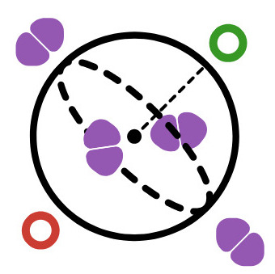

#   Guided and Nonlinear Optics Toolbox (`GuidedOptX.jl`)

This library was designed as an theoretical and numerical toolkit on light propagation estimation through optical media both in classical and quantum approach. It's mainly designed as an experimental toolbox for guided optics, but it also comprehends theoretical approach and nonlinear responses presented by materials.

##  Classical optics fundamentals

>   [**1. Fundamentals of beam optics**](./1.classical-optics/1.fundamentals-of-beam-optics.ipynb)
>   
>   This notebook will introduce the scalar wave formulation of optics, focusing on wave equation and its algebraic properties, besides the physical implications of it. Furthermore, exploring the Slow-varying envelope approximation by Fresnel approximation of spherical waves, discussing the fundamentals of gaussian beams, including their propagation and characteristics.

>   [**2. Introduction to numerical propagation methods**](./1.classical-optics/2.introduction-to-numerical-propagation-methods.ipynb)
>
>   This notebook will, firstly, introduce the basics of Fourier optics as a approach on fundamental algebraic properties of light propagation in free-space, thus extending it for inhomogeneous and non-linear optical media through split-step beam propagation method. Furthermore, discussing wavely phenomena such as diffraction, image formations and filtering, and minor examples on phase and amplitude modulations by holography.

>   [**3. Fundamentals of structured light**](./1.classical-optics/3.fundamentals-of-structured-light.ipynb)
>
>   This notebook will introduce the basics of higher order families of optical modes, namely hermite-gaussian and laguerre-gaussian modes, it will also discuss its algebraic properties such as orthogonality and symmetries. It will also approach on non-diffracting beams such as Bessel and Airy mode families.

>   [**4. Advanced numerical estimation of light propagation**](./1.classical-optics/4.advanced-numerical-estimation-of-light-propagation.ipynb)
>
>   This notebook will extends the previous approach on numerical approximation of light propagation, firstly, discussing conservation laws and introducing boundary conditions to supress numerical errors. Later, more robust methods such as Finite-differences (FD) and Finite-elements (FEM) will be introduced as alternative approaches on estimate how light propagates through optical media. Lastly, the design and simulation of neural network aided methods, namely Physics-informed Neural-networks (PINNs) will be discussed.

>   [**5. Advanced holographic methods**](./1.classical-optics/5.advanced-holographic-methods.ipynb)
>
>   This notebook will extends holographic methods commonly used at an optics lab. Firstly, multiplane light conversion (MPLC) method will be discussed, and subsequently Neural-network aided methods will be introduced, focusing mainly in optical waveguides design to implement optical operations or transformations through linear inhomogeneities of an optical media.

##  Quantum optics fundamentals

